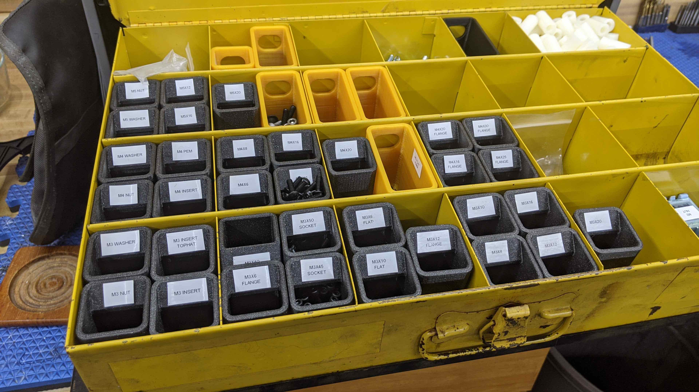

# Durham Organizer Sub Bins 

## Description
3d printable bins for storing small parts in Durham organizers without taking up an entire bin. Also adds the ability to take the bins with you to whatever you are working on. There is a small surface for adding labels from handheld label maker. 

## CAD / STL 
See source cad here. You can create a copy and make whatever edits you would like. Note - use the configuration option to switch between quarter, half, or full size bins. https://cad.onshape.com/documents/a43d7666efc3ed14d0dbea0b/w/4a826b5fe303b5eda0ed5e5d/e/a6d98f40d5e020c68fbdc2d6?configuration=List_tlJbtSDWE01EJX%3DFull

If you just want the STL files for 3d printing, see thingiverse - https://www.thingiverse.com/thing:4614881

## Pictures
